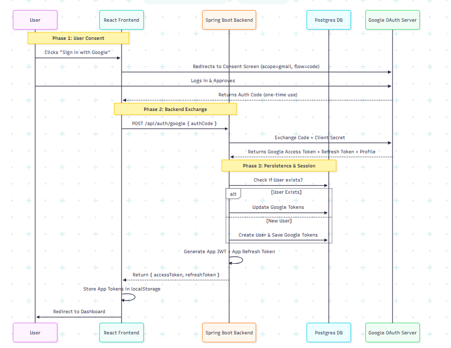

# 📧 Email Backend Service

[](https://www.oracle.com/java/technologies/javase/jdk17-archive-downloads.html)
[](https://spring.io/projects/spring-boot)
[](LICENSE)
[](#)

A production-ready, secure email management backend service built with Spring Boot. This service provides a comprehensive email solution with hybrid authentication, Gmail API integration, and real-time email synchronization capabilities.

## 🌟 Key Features

### 🔐 **Advanced Authentication System**

- **Local Authentication**: Secure email/password registration and login with JWT tokens
- **Google OAuth 2.0**: Seamless Google Sign-In with offline access capabilities
- **Dual Token Architecture**: Separate app session tokens and Google API tokens for enhanced security
- **Automatic Token Refresh**: Background token renewal without user intervention

### 📬 **Email Management**

- **Gmail API Integration**: Full Gmail functionality through secure proxy architecture
- **Mock Data Support**: Development-friendly mock email data for testing
- **Real-time Synchronization**: Live email updates and notifications
- **Label Management**: Complete mailbox organization with folder/label support
- **Pagination**: Efficient email listing with customizable page sizes

### 🛡️ **Enterprise-Grade Security**

- **JWT Access & Refresh Tokens**: Stateless authentication with automatic renewal
- **BCrypt Password Hashing**: Industry-standard password encryption
- **OAuth 2.0 Compliance**: Secure third-party authentication
- **CORS Configuration**: Controlled cross-origin resource sharing
- **API Rate Limiting**: Protection against abuse and DDoS attacks

### 🏗️ **Modern Tech Stack**

- **Backend**: Java 17+, Spring Boot 3.x, Spring Security 6, Hibernate/JPA
- **Database**: PostgreSQL with connection pooling
- **Documentation**: OpenAPI 3.0 (Swagger) integration
- **Containerization**: Docker & Docker Compose ready
- **Testing**: Comprehensive unit and integration tests

## 🏛️ System Architecture

This application implements a sophisticated **"Dual Token Architecture"** that separates application session management from third-party API access:

### Token Flow Overview

- **Frontend (React)**: Holds JWT app tokens for API authentication
- **Backend (Spring Boot)**: Securely stores Google refresh tokens for Gmail API access
- **Database (PostgreSQL)**: Persistent storage for user data and OAuth tokens



### 🔄 Authentication Flow Benefits

- **Security**: Google tokens never exposed to client-side code
- **Reliability**: Automatic token refresh prevents session interruptions
- **Scalability**: Stateless JWT architecture supports horizontal scaling
- **Flexibility**: Supports both OAuth and traditional authentication methods

## 🚀 Quick Start

### Prerequisites

- **Docker & Docker Compose** - Container orchestration
- **Java 17+** - (Optional for local development)
- **Node.js 16+** - Frontend development
- **Google Cloud Project** - Gmail API access

### 1. 🔧 Environment Setup

Create a `.env` file in the project root:

```env
# Database Configuration
POSTGRES_USER=emailapp_user
POSTGRES_PASSWORD=secure_db_password_2024
POSTGRES_DB=email_management_db

# Application Database Connection
DB_HOST=db
DB_PORT=5432
DB_NAME=email_management_db
DB_USER=emailapp_user
DB_PASSWORD=secure_db_password_2024

# Security Configuration
JWT_SECRET=your-ultra-secure-256-bit-jwt-secret-key-here-2024
JWT_EXPIRATION=86400000
JWT_REFRESH_EXPIRATION=604800000

# Google OAuth Configuration
GOOGLE_CLIENT_ID=your-google-oauth-client-id.googleusercontent.com
GOOGLE_CLIENT_SECRET=your-google-oauth-client-secret

# Application Configuration
SERVER_PORT=3000
CORS_ALLOWED_ORIGINS=http://localhost:3000,http://localhost:5173
```

### 2. 🔑 Google Cloud Setup

1. **Create Google Cloud Project**

   - Visit [Google Cloud Console](https://console.cloud.google.com/)
   - Create a new project or select existing one

2. **Enable APIs**

   ```bash
   # Enable Gmail API
   gcloud services enable gmail.googleapis.com
   ```

3. **Configure OAuth Consent Screen**

   - Add authorized domains
   - Set scopes (APIs & Services > OAuth Consent Screen > Data Access): `https://www.googleapis.com/auth/gmail.readonly`
   - Add test users (APIs & Services > OAuth Consent Screen > Data Access - for development)

4. **Create OAuth 2.0 Credentials**
   - Application type: Web application
   - Authorized origins: `http://localhost:3000`, `http://localhost:5173`
   - Redirect URIs: `http://localhost:3000/auth/callback`

### 3. 🐳 Deploy with Docker

```bash
# Build and start all services
docker-compose --env-file .env up --build -d

# View logs
docker-compose logs -f backend

# Stop services
docker-compose down
```

**Service URLs:**

- 🖥️ **Backend API**: http://localhost:3000
- 📚 **API Documentation**: http://localhost:3000/swagger-ui/index.html
- 🗄️ **Database**: localhost:5432

### 4. 🔧 Local Development

```bash
# Backend only (requires local PostgreSQL)
./mvnw spring-boot:run

# With hot reload
./mvnw spring-boot:run -Dspring-boot.run.jvmArguments="-Dspring.profiles.active=dev"
```

## 📋 API Documentation

### 🔐 Authentication Endpoints

| Method | Endpoint                  | Description          | Request Body                                       |
| ------ | ------------------------- | -------------------- | -------------------------------------------------- |
| `POST` | `/api/auth/register`      | Create new account   | `{ "email", "password", "firstName", "lastName" }` |
| `POST` | `/api/auth/login`         | Email/password login | `{ "email", "password" }`                          |
| `POST` | `/api/auth/google`        | Google OAuth login   | `{ "authCode" }`                                   |
| `POST` | `/api/auth/refresh-token` | Refresh JWT token    | `{ "refreshToken" }`                               |
| `POST` | `/api/auth/logout`        | Invalidate tokens    | `Authorization: Bearer {token}`                    |

### 📧 Email Management Endpoints

| Method | Endpoint                      | Description                | Parameters              |
| ------ | ----------------------------- | -------------------------- | ----------------------- |
| `GET`  | `/api/gmail/labels`           | Get mailbox labels/folders | -                       |
| `GET`  | `/api/gmail/list/{labelId}`   | Get emails by label        | `page`, `size`, `query` |
| `GET`  | `/api/gmail/{messageId}`      | Get specific email         | -                       |
| `POST` | `/api/gmail/send`             | Send new email             | Email payload           |
| `PUT`  | `/api/gmail/{messageId}/read` | Mark as read/unread        | `{ "read": true }`      |

### 📊 Response Format

```json
{
  "success": true,
  "data": {
    // Response payload
  },
  "message": "Operation completed successfully",
  "timestamp": "2024-11-25T10:30:00Z"
}
```

## 🛡️ Security Features

### 🔒 Authentication Security

- **JWT Tokens**: Stateless authentication with configurable expiration
- **Refresh Token Rotation**: Enhanced security with token rotation
- **Password Hashing**: BCrypt with configurable rounds
- **OAuth 2.0**: Industry-standard third-party authentication

### 🔐 API Security

- **CORS Protection**: Configurable cross-origin policies
- **Rate Limiting**: Request throttling per user/IP
- **Input Validation**: Comprehensive request validation
- **SQL Injection Prevention**: Parameterized queries with JPA

### 🚨 Error Handling

- **Global Exception Handler**: Centralized error management
- **Structured Error Responses**: Consistent error format
- **Security Headers**: HSTS, XSS protection, content type options

## 🧪 Testing

### Running Tests

```bash
# Run all tests
./mvnw test

# Run with coverage
./mvnw test jacoco:report

# Run integration tests only
./mvnw test -Dtest="*IntegrationTest"

# Run specific test class
./mvnw test -Dtest="AuthenticationServiceTest"
```

### Test Coverage

- **Unit Tests**: Service layer and utility functions
- **Integration Tests**: API endpoints and database operations
- **Security Tests**: Authentication and authorization flows
- **Mock Data Tests**: Email data simulation

## 📊 Monitoring & Observability

### Health Checks

- **Application Health**: `/actuator/health`
- **Database Connectivity**: `/actuator/health/db`
- **External APIs**: `/actuator/health/gmail-api`

### Metrics

- **Performance Metrics**: Request timing and throughput
- **Business Metrics**: User registrations, email operations
- **Error Tracking**: Exception rates and types

### Logging

```yaml
# application.yml logging configuration
logging:
  level:
    org.example: DEBUG
    org.springframework.security: DEBUG
  pattern:
    console: "%d{ISO8601} [%thread] %-5level %logger{36} - %msg%n"
```

## 🔧 Configuration

### Application Properties

Key configuration options in `application.yml`:

```yaml
# Core Application Settings
server:
  port: ${SERVER_PORT:3000}

# Database Configuration
spring:
  datasource:
    url: jdbc:postgresql://${DB_HOST}:${DB_PORT}/${DB_NAME}
    username: ${DB_USER}
    password: ${DB_PASSWORD}

# JWT Configuration
jwt:
  secret: ${JWT_SECRET}
  expiration: ${JWT_EXPIRATION:86400000}
  refresh-expiration: ${JWT_REFRESH_EXPIRATION:604800000}

# Google OAuth Configuration
google:
  client-id: ${GOOGLE_CLIENT_ID}
  client-secret: ${GOOGLE_CLIENT_SECRET}
```

## 📈 Performance Optimization

### Database Optimizations

- **Connection Pooling**: HikariCP with optimized settings
- **Query Optimization**: Indexed columns and efficient queries
- **Lazy Loading**: JPA relationships optimized for performance

### Caching Strategy

- **Redis Integration**: Session and frequently accessed data
- **Application-Level Caching**: @Cacheable annotations
- **HTTP Caching**: ETag and Last-Modified headers

### API Performance

- **Pagination**: Efficient data loading for large datasets
- **Async Processing**: Non-blocking email operations
- **Rate Limiting**: Prevent API abuse and ensure fair usage

## 🚀 Deployment

### Production Deployment

```bash
# Build production JAR
./mvnw clean package -Pprod

# Create Docker image
docker build -t email-backend:latest .

# Deploy with Docker Compose
docker-compose -f docker-compose.prod.yml up -d
```

### Environment Variables (Production)

```env
# Security (Use strong values in production)
JWT_SECRET=your-production-jwt-secret-minimum-256-bits
GOOGLE_CLIENT_SECRET=your-production-google-secret

# Database (Use managed database service)
DB_HOST=your-production-db-host
DB_PASSWORD=your-production-db-password

# Monitoring
ENABLE_METRICS=true
LOG_LEVEL=INFO
```

## 🔄 Development Workflow

### Code Quality

```bash
# Format code
./mvnw spotless:apply

# Static analysis
./mvnw spotbugs:check

# Dependency check
./mvnw versions:display-dependency-updates
```

### Git Workflow

```bash
# Feature development
git checkout -b feature/new-email-feature
git commit -m "feat: add email search functionality"
git push origin feature/new-email-feature

# Create pull request with tests and documentation
```

## 🐛 Troubleshooting

### Common Issues

**Issue**: JWT token expired

```bash
# Solution: Check token expiration settings
jwt.expiration=86400000  # 24 hours in milliseconds
```

**Issue**: Google OAuth fails

```bash
# Check OAuth redirect URIs match exactly
GOOGLE_REDIRECT_URI=http://localhost:3000/auth/callback
```

**Issue**: Database connection fails

```bash
# Verify database container is running
docker-compose ps db

# Check database logs
docker-compose logs db
```

### Debug Mode

Enable debug logging for troubleshooting:

```yaml
logging:
  level:
    org.example: DEBUG
    org.springframework.security: DEBUG
    org.springframework.web: DEBUG
```

## 🤝 Contributing

### Development Setup

1. Fork the repository
2. Create feature branch (`git checkout -b feature/amazing-feature`)
3. Make changes with tests
4. Commit changes (`git commit -m 'feat: add amazing feature'`)
5. Push to branch (`git push origin feature/amazing-feature`)
6. Open Pull Request

### Code Standards

- **Java**: Follow Google Java Style Guide
- **Testing**: Minimum 80% test coverage
- **Documentation**: Update README and API docs
- **Commits**: Use Conventional Commits format

## 📄 License

This project is licensed under the MIT License - see the [LICENSE](LICENSE) file for details.

## 🙏 Acknowledgments

- **Spring Boot Team** - Excellent framework and documentation
- **Google Cloud** - Gmail API and OAuth services
- **PostgreSQL** - Reliable database platform
- **Docker** - Containerization platform

## 📞 Support

For support and questions:

- 📧 **Email**: support@yourdomain.com
- 🐛 **Issues**: [GitHub Issues](https://github.com/yourusername/email-backend/issues)
- 📖 **Documentation**: [API Docs](http://localhost:3000/swagger-ui/index.html)

---

**Built with ❤️ by [Your Team Name]**

---

> **Note**: This is a demonstration project. For production use, ensure proper security audits, monitoring, and compliance with data protection regulations.
